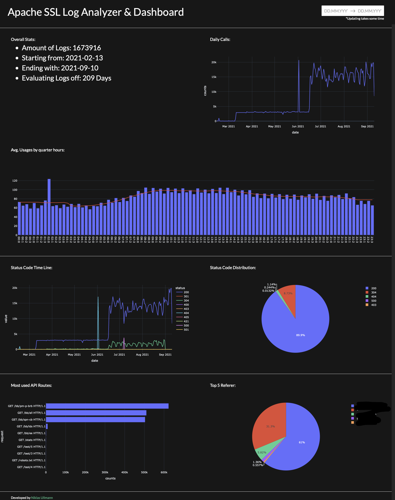

# ApacheLog_Analyzer
Apache SSL Log Analyzer and Dashboard for API Usage

## Features
- Analyze and evaluate your Apache SSL Log File 

## Screenshots


## Execute Code

- Create Virtual Environment
```python3 -m venv venv```

- Activate Virtual Environment
 - On Windows, run:
```venv\Scripts\activate.bat```

 - On Unix or MacOS, run:
```source venv/bin/activate```


- Install requiered packages:
```python3 -m pip install -r requirements.txt```

- Run Code:
```python3 main.py --path=access_ssl_log```